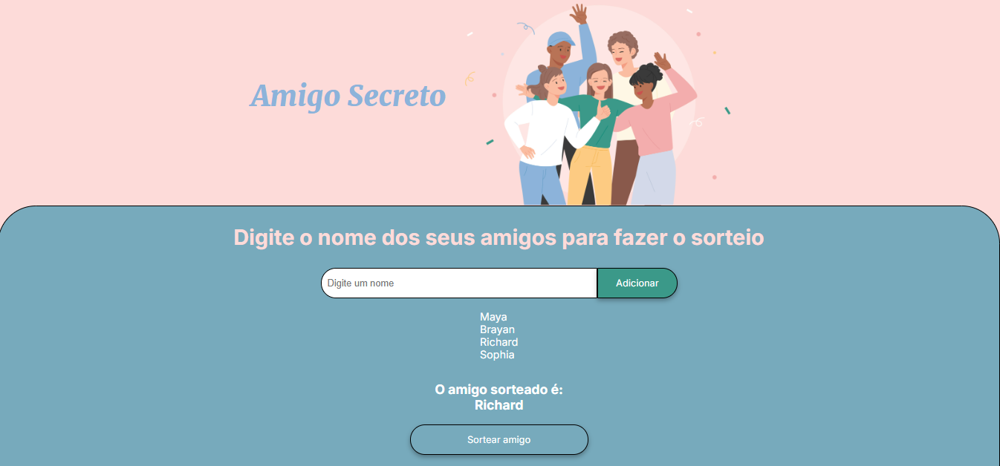

# 🔒 **Challenge | Amigo Secreto**

Este challenge faz parte do Programa ONE, uma parceria entre Oracle e Alura LATAM. O principal objetivo deste challenge é aprimorar habilidades em lógica de programação com JavaScript, criando uma aplicação capaz de realizar sorteios e revelar quem é o Amigo Secreto.

## 🚀 Como Funciona

1. Digite o nome de um amigo no campo de texto e clique em **Adicionar**.
2. Após cada nome ser adicionado, ele será exibido na lista para você conferir.
3. Quando você estiver pronto, clique em **Sortear Amigo** e veja quem foi o "Amigo Secreto" sorteado de maneira aleatória! 🍀

## 🌐 Acesse e Teste

Você pode acessar e testar a aplicação diretamente no seguinte link:  
[**Sorteio | Amigo Secreto**](URL_DO_SEU_SITE_AQUI)
